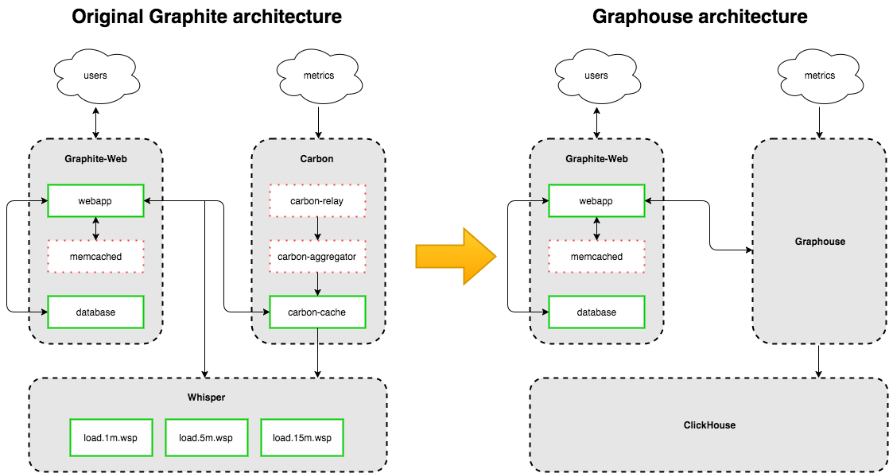

Graphouse allows you to use [ClickHouse](https://github.com/yandex/ClickHouse) as a Graphite storage.

[Installation guide](doc/install.md)

[Configuration](doc/config.md)

[Build](doc/build.md)

Overview
--------
Graphouse provides:
- TCP server to receive metrics with [Graphite plaintext protocol](http://graphite.readthedocs.io/en/latest/feeding-carbon.html#the-plaintext-protocol).
- HTTP API for metric search and data retrieval (with graphite-web python module).
- HTTP API for metric tree management.

Comparing Graphouse with [common Graphite architecture](https://github.com/graphite-project/graphite-web#overview).

Contacts
--------
If you have any questions, feel free to join our Telegram chat
https://t.me/graphouse
